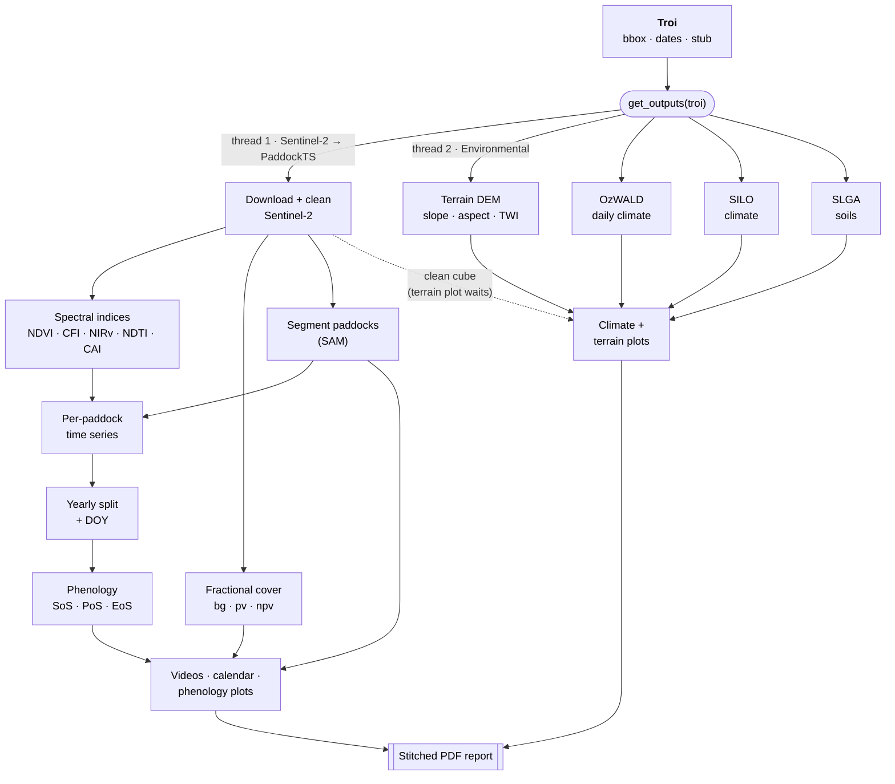

# PaddockTS: paddock-level satellite time series analysis of agroecosystem dynamics

[](https://github.com/johnburley3000/paddocktimeseries/actions/workflows/tests.yml)
[](https://johnburley3000.github.io/paddocktimeseries/)
[](LICENSE)
[](https://www.python.org/)
[](https://doi.org/10.31223/X5821Z)

**Preprint:** [Burley et al. (2026), EarthArXiv](https://doi.org/10.31223/X5821Z)

**Documentation:** <https://johnburley3000.github.io/paddocktimeseries/>

**Code-free web tool:** [paddocktimeseries.net](https://paddocktimeseries.net) by Yasar Adeel Ansari

Built at the [Borevitz Lab, Australian National
University](https://biology.anu.edu.au/research/research-groups/borevitz-group-plant-genomics-climate-adaption) for ecologists, agronomists,
and remote-sensing researchers who want a reproducible pipeline for
Sentinel-2 imagery to paddock (or field) boundaries and paddock-level
summaries of greenness, ground cover, and phenology.

---

## What it does

Give PaddockTS a time and region of interest ([`troi`](https://github.com/thestochasticman/troi)). It produces:

- **Reusable Sentinel-2 raster time series** — multispectral observations
  are stored in a spatial, time-indexed cache managed by
  [`pysentinel2`](https://github.com/thestochasticman/pysentinel2).
  The raster stack can be reopened for other analyses, with cloud masking
  and spectral indices applied on read.
- **Paddock boundaries** — automatic field-boundary detection using
  [Segment Anything](https://segment-anything.com/) through
  [`segment-geospatial`](https://samgeo.gishub.org/) (`samgeo`), applied
  to an NDWI Fourier-feature image. The resulting GeoPackage contains
  paddock geometries, identifiers, areas, and shape compactness.
- **Compact paddock-level time series** — median surface reflectance,
  spectral indices, and fractional cover for each paddock and observation
  date, stored as Zarr datasets on `(paddock, time)`. PaddockTS also
  produces resampled, gap-filled, and smoothed time series.
- **Spectral indices and fractional cover** — PaddockTS computes NDVI,
  CFI, NIRv, NDTI, and CAI. It also estimates bare ground (`bg`), green
  vegetation (`pv`), and non-green vegetation (`npv`) using a TFLite
  model adapted from
  [`fractionalcover3`](https://github.com/jrsrp/fractionalcover3).
- **Phenology metrics** — start, peak, and end of season, together with
  seasonal amplitudes and integrals, calculated for each paddock and
  year using a vendored version of
  [`phenolopy`](https://github.com/lewistrotter/phenolopy).
- **Environmental context** — Copernicus 30 m elevation and derived
  terrain variables; [OzWALD](https://www.wenfo.org/ozwald/) and
  [SILO](https://www.longpaddock.qld.gov.au/silo/) daily climate data;
  and [SLGA](https://esoil.io/TERNLandscapes/Public/Pages/SLGA/index.html)
  90 m soil properties, all matched to the same area of interest.
- **Plots, videos, and reports** — true-colour and fractional-cover
  time-lapse videos, paddock calendar plots, phenology curves, climate
  and terrain panels, and a combined PDF report.

Alternatively, supply your own paddock boundaries, optionally labelled
with management categories or outcomes. PaddockTS can analyse these
instead of, or alongside, automatically segmented paddocks.

Shared data stores reuse previously downloaded observations across
overlapping areas and dates. Derived PaddockTS intermediates are reused
when the area and date range match. Incomplete cached writes are detected
and rebuilt on the next run.

---

## Install

### Conda + pip (recommended)

The conda environment provides the native stack (GDAL/PROJ/GEOS,
PyTorch, TensorFlow, Segment Anything); `pip install .` then pulls the
lab packages — the `troi` core and the five data stores — from PyPI,
pinned to the releases tested with this version:

```bash
git clone https://github.com/johnburley3000/paddocktimeseries.git
cd paddocktimeseries
conda env update -n paddockts -f environment.yml
conda activate paddockts
pip install .
```

PaddockTS targets Python ≥ 3.11.

> **Hardened-kernel note (Fedora / recent glibc).** If `import
> tensorflow` fails with *"cannot enable executable stack as shared
> object requires"*, your kernel enforces non-executable stacks and
> conda-forge's TensorFlow libraries request one. Clear the flag once
> (the libraries are in your env, so no root needed):
>
> ```bash
> conda install -n paddockts -c conda-forge patchelf   # or use execstack
> find "$CONDA_PREFIX" -name '*.so*' -exec sh -c \
>   'execstack -c "$1" 2>/dev/null || true' _ {} \;
> ```
>
> Most Linux systems don't hit this.

### Conda only

Everything — PaddockTS, the `troi` core, the five data stores, and the
full native stack — is also available as conda packages, installable
in one command with no pip step:

```bash
conda create -n paddockts -c conda-forge -c thestochasticman paddocktimeseries
conda activate paddockts
```

(The packages are being added to conda-forge itself
([conda-forge/staged-recipes#34735](https://github.com/conda-forge/staged-recipes/pull/34735));
once merged, `-c thestochasticman` can be dropped.)

### From source (development)

```bash
git clone https://github.com/thestochasticman/troi.git
git clone https://github.com/thestochasticman/pysentinel2.git
git clone https://github.com/thestochasticman/pysilo.git
git clone https://github.com/thestochasticman/pyozwald.git
git clone https://github.com/thestochasticman/pycopdem.git
git clone https://github.com/thestochasticman/pyslga.git
git clone https://github.com/johnburley3000/paddocktimeseries.git
cd paddocktimeseries
conda env update -n paddockts -f environment.yml   # native + scientific stack
conda activate paddockts
pip install --no-deps -e ../troi -e ../pysentinel2 -e ../pysilo \
            -e ../pyozwald -e ../pycopdem -e ../pyslga -e .
```

### Configure (optional)

Default output and cache directories are `~/Documents/Troi-Outputs`
and `~/Downloads/Troi-Tmp`. Override and add credentials by
creating `~/.config/Troi.json`:

```json
{
  "out_dir": "/data/paddockts/outputs",
  "tmp_dir": "/data/paddockts/tmp",
  "email": "you@example.org",
  "tern_api_key": "<your-tern-key>"
}
```

Settings can also come from environment variables
(`TROI_OUTDIR`, `TROI_TMPDIR`, `TROI_EMAIL`,
`TROI_TERN_KEY`).

**Credentials:**

- `email` is required only by the SILO climate stage
- `tern_api_key` is required only by the SLGA soils stage — generate
  one at <https://account.tern.org.au/>

The Sentinel-2 → PaddockTS chain itself works without any credentials.

You can also pass configuration directly to `Troi` via a `Config`
object — see the [Getting started](https://johnburley3000.github.io/paddocktimeseries/getting-started/)
page.

---

## Runnable demos

Three Jupyter notebooks under [`demo/`](demo/) walk through the most
common workflows:

- [`demo/01_quickstart.ipynb`](demo/01_quickstart.ipynb) — bbox + dates → `get_outputs(troi)` → review the calendar / phenology / PDF.
- [`demo/02_pipeline_stages.ipynb`](demo/02_pipeline_stages.ipynb) — call each Sentinel-2 stage individually, inspect intermediate outputs.
- [`demo/03_custom_paddocks.ipynb`](demo/03_custom_paddocks.ipynb) — bring your own paddock boundaries and skip SAM.

```bash
jupyter lab demo/
```

---

## Tests

The offline unit suite under [`tests/`](tests/) verifies the index
math, fractional-cover unmixing, per-paddock median aggregation,
smoothing, phenology metrics, and the caching contract — all against
synthetic inputs, with no network access or credentials. It runs on
every push via [GitHub Actions](.github/workflows/tests.yml):

```bash
pip install -e '.[tests]'
pytest
```

End-to-end acceptance scripts that exercise the full pipeline against
the live data services live in [`test/`](test/) — see
[`test/about_testing.md`](test/about_testing.md).

Reproduce the demonstration analysis from Burley et al., 2026:
Run
[`demo/Milgadara_2018-25_case_study.py`](demo/Milgadara_2018-25_case_study.py)
Followed by
[`demo/Milgadara_demonstration.ipynb`](demo/Milgadara_demonstration.ipynb)

---

## Quick example

```python
from datetime import date
from troi.troi import Troi
from PaddockTS.get_outputs import get_outputs

troi = Troi(
    bbox=[148.36265, -33.52606, 148.38265, -33.50606],  # [W, S, E, N]
    start=date(2020, 1, 1),
    end=date(2021, 12, 31),
    stub="my_first_run",
)

get_outputs(troi)
```

This kicks off both pipelines (Sentinel-2 → PaddockTS and Environmental)
in parallel and renders a live dashboard. The next `get_outputs(troi)`
on the same `Troi` skips every cached step.

Outputs land under `~/Documents/Troi-Outputs/<stub>/`:

| File | What's in it |
|---|---|
| `<stub>_paddocks.gpkg` | Segmented paddock polygons + `area_ha` + `compactness` |
| `<stub>_paddockTS.zarr` | Per-paddock medians for every band + index, on `(paddock, time)` |
| `<stub>_paddockTS_<year>.zarr` | Yearly slices with a DOY coordinate |
| `<stub>_sentinel2.mp4` | True-colour Sentinel-2 timeline |
| `<stub>_fractional_cover.mp4` | Bare/green/non-green RGB timeline |
| `<stub>_calendar_<year>_p01.png` | Per-paddock thumbnail calendar |
| `<stub>_phenology_p01.png` | SoS/PoS/EoS curves per paddock per year |
| `<stub>_topography.png` | Elevation, slope, aspect, flow accumulation |
| `<stub>.pdf` | Stitched report combining every plot |

---

## Bring your own paddocks

If you already have field boundaries (QGIS export, cadastral layer,
previous run), skip SAM segmentation and use them directly.

Importantly, tell build_from_paddocks() which column of your .gpkg specifies paddock name using label_col="".

```python
from datetime import date
from troi.troi import Troi
from PaddockTS.get_outputs import get_outputs

paddocks_fp = "/path/to/paddocks.gpkg"  # .gpkg, .shp, or .geojson

troi = Troi.build_from_paddocks(
    paddocks_filepath=paddocks_fp,
    start=date(2024, 1, 1),
    end=date(2024, 12, 31),
    stub="my_farm",
    label_col="paddock_name",
)

get_outputs(
    troi,
    paddocks_filepath=paddocks_fp,
    skip_sam=True,
    label_col="paddock_name",
)
```

---

## Pipeline at a glance

`get_outputs(troi)` runs two pipelines on parallel threads. The
Sentinel-2 chain segments paddocks and builds the per-paddock time
series, phenology, and plots; the Environmental chain pulls terrain,
climate, and soils. Both feed the final stitched PDF.



The table below is the same chain, stage by stage:

| Sentinel-2 → PaddockTS | Environmental |
|---|---|
| Download Sentinel-2 + clean | Download terrain (Copernicus DEM) |
| Compute spectral indices | Download OzWALD daily climate |
| Compute fractional cover | Download SILO climate |
| Sentinel-2 video | Download SLGA soils |
| Segment paddocks (SAM) | OzWALD plot |
| Sentinel-2 + paddocks video | SILO plot |
| Fractional cover video | Terrain plot |
| Fractional cover + paddocks video | |
| Make paddock time series | |
| Make yearly paddock time series | |
| Estimate phenology | |
| Calendar plot | |
| Phenology plot | |
| PDF report | |

Every stage is a standalone function — pick any subset, swap in your
own segmentation, plug in your own phenology library. See the
[pipeline page](https://johnburley3000.github.io/paddocktimeseries/pipeline/)
for the full call-graph and per-stage caching behaviour.

---

## Calling individual stages

```python
from pysentinel2.cube import Cube
from PaddockTS.FractionalCover import compute_fractional_cover
from PaddockTS.PaddockSegmentation.get_paddocks import get_paddocks

cube = Cube(config=troi.config)
ds = cube.get_ds_troi(troi, clean=True,                # cloud-masked window
                      indices=("NDVI", "CFI", "NIRv", "NDTI", "CAI"))
fc = compute_fractional_cover(troi, ds_sentinel2=ds)   # bg / pv / npv
paddocks = get_paddocks(troi, ds_sentinel2=ds)         # GeoDataFrame
```

Every function loads its own inputs from the cache if you don't pass
them, so you can call them out of order or in isolation.

---

## Data sources and acknowledgments

PaddockTS does not redistribute upstream data; it queries them on
demand:

- **Sentinel-2 ARD** — Geoscience Australia
  [Digital Earth Australia](https://explorer.dea.ga.gov.au/) STAC.
- **Copernicus DEM 30 m** —
  [AWS Open Data](https://registry.opendata.aws/copernicus-dem/).
- **OzWALD** — Australian Water and Landscape Dynamics, hosted by ANU.
- **SILO** — Queensland Government's gridded climate dataset.
- **SLGA** — TERN / CSIRO Soil and Landscape Grid of Australia
  (TERN API key required).

---

## Citation

Please cite the associated EarthArXiv preprint when using PaddockTS in
research:

> Burley, J. T., Ansari, Y. A., Bradley, C., Norton, A., & Borevitz, J.
> (2026). *PaddockTS: paddock-level satellite time series analysis of
> agroecosystem dynamics*. EarthArXiv.
> <https://doi.org/10.31223/X5821Z>

Machine-readable citation metadata is provided in
[`CITATION.cff`](CITATION.cff). 

Please also cite the upstream datasets and methods relevant to your analysis.

---

## License and attribution

PaddockTS is **MIT-licensed** — see [LICENSE](LICENSE).

### Vendored code

Third-party code shipped inside the package; see
[`PaddockTS/LICENSES/`](PaddockTS/LICENSES/) for full license texts:

- [`fractionalcover3`](https://gitlab.com/jrsrp/themes/cover/fractionalcover3) by
  Robert Denham — MIT. The TFLite unmixing models and the unmixing
  routine in `PaddockTS.FractionalCover._unmix` are adapted from this
  work.
- [`phenolopy`](https://github.com/lewistrotter/phenolopy) by
  Lewis Trotter — Apache 2.0. Vendored verbatim under
  `PaddockTS.Phenology._phenolopy` (with minor NumPy 2.0 compatibility
  fixes documented in the file header) and used through
  `PaddockTS.Phenology.estimate_phenology`.
- [`DAESIM_preprocess`](https://github.com/ChristopherBradley/DAESIM_preprocess) by
  Christopher Bradley — MIT. Environmental data harvesting functions
  adapted in the pyozwald / pysilo / pyslga / pycopdem stores for
  downloading and processing climate, vegetation, soil, and
  topographic datasets.

### Key runtime dependencies

Installed as regular dependencies, not vendored — please cite if
relevant to your work:

- [`segment-geospatial`](https://samgeo.gishub.org/) (`samgeo`) by
  Qiusheng Wu — MIT. Wraps Segment Anything for geospatial use; drives
  the paddock segmentation stage. Cite:
  [Wu & Osco (2023), J. Open Source Software](https://joss.theoj.org/papers/10.21105/joss.05663).
- [`Segment Anything Model (SAM)`](https://arxiv.org/abs/2304.02643) by
  Meta AI Research — Apache 2.0. The underlying segmentation model.

---

## Contributing & support

- **Bug reports / feature requests:**
  [GitHub Issues](https://github.com/johnburley3000/paddocktimeseries/issues)
- **Documentation:**
  <https://johnburley3000.github.io/paddocktimeseries/>
- **Known failure modes:** [`diagnostics.md`](diagnostics.md) (DEA STAC
  cold-start, GDAL HTTP auth)
- **Maintainers:** [John T. Burley](https://github.com/johnburley3000)
  and [Yasar Adeel Ansari](https://github.com/thestochasticman)
