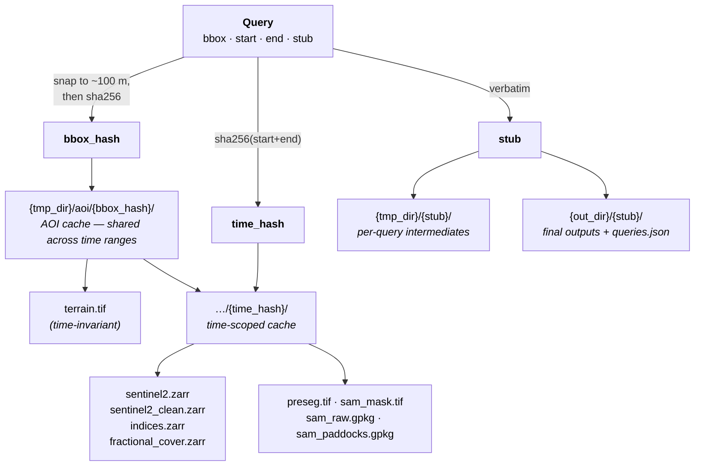

# Query & Config

The `Query` is the immutable, content-addressed object that flows
through every stage of the pipeline. A `Query` describes a region
(bounding box, EPSG:4326) and a time window; every stage derives its
input and output paths from it.

The `Config` controls global behavior — where outputs go, where caches
live, and credentials for the SILO and SLGA stages. A `Config` is
attached to every `Query` (defaulting to the one loaded from
`~/.config/PaddockTS.json`, or built-in defaults if that file is
absent).

---

## Key ideas

- **Content addressing.** If you don't pass a `stub`, it's computed as
  `sha256(bbox + start + end)` so two queries with identical inputs
  share outputs on disk.
- **AOI cache.** Bounding boxes are snapped to ~100 m precision
  (3 decimal places) before hashing into `bbox_hash`. Two queries with
  the same bbox but different date ranges share the AOI directory
  (`{tmp_dir}/aoi/{bbox_hash}/`) — so the Sentinel-2 download for
  jan-feb 2024 lives next to the one for mar-apr 2024.
- **Registry.** Every constructed `Query` is recorded in
  `{config.out_dir}/queries.json` under its `bbox_hash`. Reusing a
  `stub` for a different `(bbox, start, end)` raises `ValueError`.
- **Per-query paths.** `query.sentinel2_path`,
  `query.fractional_cover_path`, `query.sam_paddocks_path`,
  `query.terrain_path` etc. are computed lazily from the stub and bbox
  hash — see the auto-generated reference below.

The diagram below shows how the four inputs fan out into hashes and
on-disk paths. Note the two distinct cache scopes: the **AOI cache**
(`bbox_hash`) is shared by every time range over the same region, while
the **time-scoped cache** (`bbox_hash/time_hash`) holds the Sentinel-2
chain for one specific window. The human-readable `stub` only names the
per-query scratch and final-output directories.



---

## Construct a `Query`

### From a bounding box

```python
from datetime import date
from PaddockTS.query import Query

q = Query(
    bbox=[148.36265, -33.52606, 148.38265, -33.50606],  # [W, S, E, N]
    start=date(2020, 1, 1),
    end=date(2021, 12, 31),
    stub="my_first_run",
)

print(q.sentinel2_path)
# ~/Downloads/PaddockTS-Tmp/aoi/<bbox_hash>/<time_hash>/sentinel2.zarr
print(q.out_dir)
# ~/Documents/PaddockTS-Outputs/my_first_run
```

### From a centre point + buffer in km

```python
q = Query.from_lat_lon(
    lat=-35.098087,
    lon=148.929983,
    buffer_km=2.0,       # ~ 4 km × 4 km AOI
    start=date(2025, 1, 1),
    end=date(2025, 6, 30),
    stub="point_buffered",
)
```

### From an existing paddocks file

```python
q = Query.build_from_paddocks(
    paddocks_filepath="/path/to/paddocks.gpkg",
    start=date(2024, 1, 1),
    end=date(2024, 12, 31),
    stub="my_farm",
    label_col="paddock_name",
)
```

Reads the file (`.gpkg`, `.shp`, `.geojson`, or `.json`), reprojects to
EPSG:4326 if needed, takes the envelope of all features as the bbox,
and optionally renames `label_col` → `"paddock"` for downstream
compatibility.

---

## Custom config

The default `Config` reads from `~/.config/PaddockTS.json` if present,
otherwise uses `~/Documents/PaddockTS-Outputs` and
`~/Downloads/PaddockTS-Tmp`. Override per-Query by passing a `Config`
explicitly:

```python
from PaddockTS.config import Config
from PaddockTS.query import Query

cfg = Config(
    out_dir="/data/paddockts/outputs",
    tmp_dir="/data/paddockts/tmp",
    email="you@example.org",          # required for SILO
    tern_api_key="<your-tern-key>",   # required for SLGA
)

q = Query(
    bbox=[148.36265, -33.52606, 148.38265, -33.50606],
    start=date(2020, 1, 1),
    end=date(2021, 12, 31),
    stub="my_run",
    config=cfg,
)
```

---

## `Query` reference

::: PaddockTS.query

---

## `Config` reference

::: PaddockTS.config
